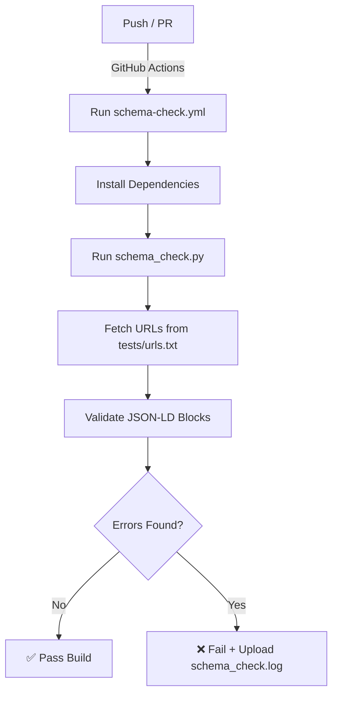

# 🧠 JSON-LD Schema Validator – icgiyimozel.com


> 🚀 **icgiyimozel.com’un otomatik Schema.org doğrulama altyapısı**  
> Bu sistem, her push veya PR işleminde sitenin tüm önemli sayfalarındaki **JSON-LD** etiketlerini test eder,  
> hatalı structured data alanlarını tespit eder ve raporlar.

---

## 💡 Amaç

icgiyimozel.com, Türkiye’nin en kapsamlı iç giyim e-ticaret altyapılarından biridir.  
Bu proje, Google ve Merchant Center entegrasyonlarında **yapılandırılmış verilerin hatasız** kalmasını sağlar.

**Hedef:**
- 🔎 Google Rich Snippet’larda doğru ürün bilgisi  
- 🛍️ Merchant Center feed’lerinde sorunsuz validasyon  
- ⚙️ Her ürün, kategori, marka ve liste sayfasında geçerli JSON-LD verisi  
- 🧠 Google Knowledge Graph için stabil `@id` bağlantıları  

---

## ⚙️ Sistem Akışı



> Her adımda validasyon otomatik yapılır; hatalı sayfalar build sürecinde fark edilir.

---

## 🧩 Kurulum

### 1️⃣ Gereken Dosyalar
| Dosya | Açıklama |
|-------|-----------|
| `tests/schema_check.py` | JSON-LD doğrulama betiği |
| `tests/urls.txt` | Kontrol edilecek sayfalar listesi |
| `tests/requirements.txt` | Python bağımlılıkları |
| `.github/workflows/schema-check.yml` | GitHub Actions workflow dosyası |

---

### 2️⃣ Kurulum Adımları (Yerel)

```bash
pip install -r tests/requirements.txt
python tests/schema_check.py
```

> veya GitHub Actions otomatik olarak çalıştırır 🚀  

---

## 📁 Dosya Yapısı

```bash
📦 jsontest/
 ┣ 📂 tests/
 ┃ ┣ 📜 schema_check.py
 ┃ ┣ 📜 urls.txt
 ┃ ┗ 📜 requirements.txt
 ┣ 📂 .github/workflows/
 ┃ ┗ 📜 schema-check.yml
 ┗ 📜 README.md
```

---

## 🧰 Kullanılan Teknolojiler

| Kütüphane | İşlev |
|------------|--------|
| **extruct** | HTML içinden JSON-LD ayrıştırma |
| **lxml==4.9.3** | DOM işleme (sabit sürüm, uyum garantili) |
| **jsonschema** | JSON yapısı doğrulama |
| **tqdm** | Komut satırı ilerleme çubuğu |
| **requests** | Sayfa içeriği alma (GET) |

> 💡 `lxml==4.9.3` sabitlenmesi, `ImportError: _ElementStringResult` hatasını çözer.  
> Yeni 5.x sürümleri `extruct` ile uyumsuzdur.

---

## 🔍 Çalışma Örneği

```
Schema check started: Wed Oct  8 07:25:40 UTC 2025
URLs file: tests/urls.txt

[OK] 2 JSON-LD blocks found on https://www.icgiyimozel.com/push-up-sutyen-494-urunleri
[OK] 1 JSON-LD block found on https://www.icgiyimozel.com/marka/bella-notte
[ERROR] Missing @id on https://www.icgiyimozel.com/pijama-modelleri

✅ Completed. 12 URLs checked, 1 error.
```

> Hatalar `schema_check.log` dosyasında saklanır ve GitHub Actions altında “Artifacts” sekmesinde görüntülenebilir.

---

## 🧾 URLs.txt Örneği

```txt
https://www.icgiyimozel.com/push-up-sutyen-494-urunleri
https://www.icgiyimozel.com/erotik-kadin-ic-giyim-41-modelleri
https://www.icgiyimozel.com/marka/bella-notte
```

> Listeyi kategori, marka ve ürün bazında genişletebilirsin.  
> Her URL ayrı ayrı JSON-LD kontrolünden geçer.

---

## 🌈 Katkı Sağlamak

Yeni structured data tipleri eklemek istiyorsan (ör. `FAQPage`, `BreadcrumbList`, `VideoObject`):

1. `validate_jsonld()` fonksiyonunu genişlet  
2. Yeni test tipini `schema_check.py` içine ekle  
3. PR gönder 🎯  
4. Build sonrası sonuçları GitHub Actions’ta kontrol et  

---

## 🏆 icgiyimozel.com – Yapılandırılmış Veri Mimarisi

| Alan | Tür | Schema.org Tipi |
|------|-----|-----------------|
| Ana Sayfa | Kurumsal bilgi | `Organization` |
| Ürün Detay | Ürün bilgisi | `Product` |
| Kategori | Ürün listesi | `ItemList` |
| Marka | Marka tanımı | `Brand` |
| Blog | İçerik makalesi | `Article` |

> 🔗 Tüm @id alanları `https://www.icgiyimozel.com/#organization` temelinde yapılandırılmıştır.  
> Bu sayede Google Knowledge Graph ilişkileri sorunsuz kurulur.

---

## 💬 Öne Çıkan Faydalar

| 🚀 Alan | Kazanç |
|----------|--------|
| SEO | Rich Snippet ve yıldızlı görünüm artışı |
| Merchant | Feed hataları azalır |
| Hız | Hatalar build anında fark edilir |
| Güven | Google Knowledge Graph’ta temiz ilişki |
| Ölçeklenebilirlik | Yeni ürün/kategori eklendiğinde sistem otomatik test eder |

---

## 🪄 Geliştirici Notu

> Her ürün bir veri,  
> her veri bir hikâye.  
> Biz sadece iç giyim satmıyoruz — Google’a doğru hikâyeyi anlatıyoruz.  
> 👗 [**icgiyimozel.com**](https://www.icgiyimozel.com)  

---

## 🧾 Lisans

**© 2025 BK Bilgi Teknolojileri ve Ticaret A.Ş.**  
Bu proje, icgiyimozel.com altyapısının bir parçasıdır.  
İzinsiz kopyalanamaz veya ticari olarak çoğaltılamaz.
